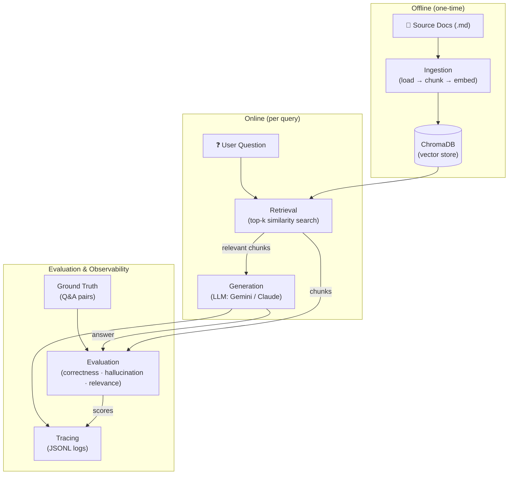

# RAG Agent with Eval & Observability

A RAG-based Q&A agent built on Anthropic Claude, designed to demonstrate **production-grade evaluation and observability** — not just the RAG pipeline itself.

The core idea: building a RAG system is the easy part. Knowing whether it actually works — detecting hallucinations, measuring retrieval quality, and tracing every step — is the hard part. This project tackles that head-on.

## What This Project Demonstrates

1. **Automated Answer Evaluation** — Run a ground-truth Q&A test suite to score correctness, with LLM-as-judge and exact-match metrics
2. **Hallucination Detection** — Check whether the generated answer stays within the scope of retrieved documents
3. **Retrieval Quality Assessment** — Measure whether the chunks pulled from the vector store are actually relevant to the question
4. **End-to-End Tracing** — Every query produces a structured trace: retrieval → prompt construction → generation → eval results, stored as append-only JSONL
5. **Multi-Model Routing** — Compare responses across providers (Claude + Azure OpenAI) for cost/quality tradeoffs

## Architecture



## Tech Stack

| Component | Choice | Why |
|-----------|--------|-----|
| LLM (generation) | Gemini 3.6 Flash (free) / Claude Sonnet 5 | Gemini for dev, Claude for production quality |
| LLM (eval judge) | Gemini 3.6 Flash (free) / Claude Haiku 4.5 | Fast & cheap for automated scoring |
| Embeddings | `all-MiniLM-L6-v2` (local) | No API dependency, good enough for demo |
| Vector DB | ChromaDB | Simple, embedded, no infra needed |
| Document processing | LangChain text splitters | Battle-tested chunking |
| Config | Pydantic Settings | Type-safe, .env support |
| CLI | Typer + Rich | Clean developer UX |

## Project Structure

```
src/rag_agent_eval/
├── ingestion/       # Document loading, chunking, embedding, indexing
├── retrieval/       # Vector search, reranking
├── generation/      # LLM prompt construction & response generation
├── eval/            # Answer correctness, hallucination, retrieval quality
├── tracing/         # Structured trace records (JSONL), trace viewer
├── config.py        # Centralized settings (Pydantic)
└── cli.py           # CLI entry point (Typer)

data/
├── raw/             # Source documents
├── vectordb/        # ChromaDB persistent storage
├── ground_truth/    # Q&A test pairs for evaluation
├── traces/          # Query trace logs (JSONL)
└── eval_results/    # Evaluation run outputs
```

## Quick Start

```bash
# Clone & setup
git clone https://github.com/YOUR_USERNAME/rag-agent-eval.git
cd rag-agent-eval
cp .env.example .env   # Add your GEMINI_API_KEY (free at https://aistudio.google.com/apikey)

# Install
pip install -e ".[dev]"

# Ingest documents
rag ingest ./data/raw/

# Ask a question
rag ask "How do I use tool use with the Claude API?"

# Run evaluation
rag evaluate

# View traces
rag traces --limit 5
```

## Knowledge Base

Default: [Anthropic Claude API documentation](https://docs.anthropic.com/). Configurable via `knowledge_base_source` in settings.

## License

MIT
